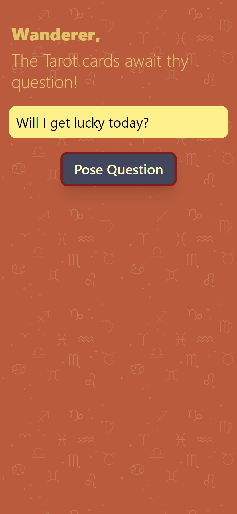
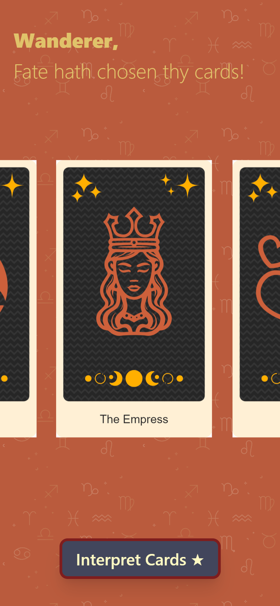
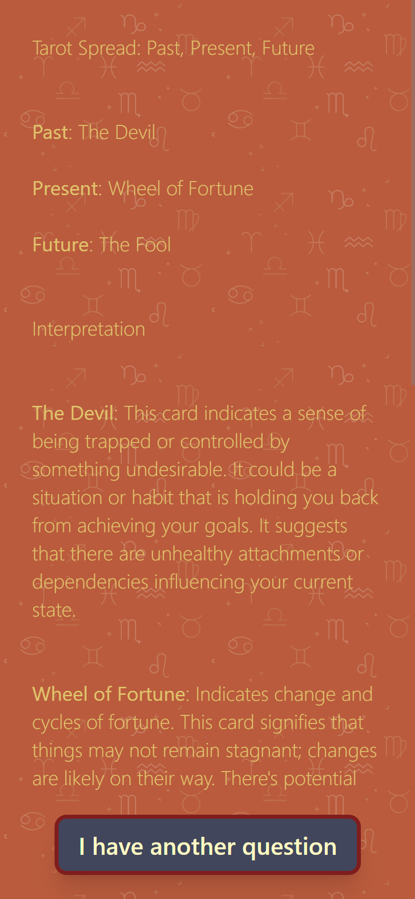

# Tarot AI - Telegram Mini App

**[Tarot Card Prophecy Bot](https://t.me/aitarotcard_bot)**

Tarot AI is an open-source Telegram Mini App that brings the ancient art of tarot reading to the digital age. Using AI, this app provides insightful and personalized tarot readings directly within Telegram.

## Features

- **AI-Powered Tarot Readings**: Get accurate and personalized tarot readings powered by advanced AI algorithms.
- **Multiple AI Providers**: Supports several AI providers like GigaChat, Groq, and more. Easily extendable to add any other AI provider.
- **Interactive Interface**: User-friendly and interactive interface designed for seamless user experience.
- **User Statistics**: Track user activity and preferences using Firebase for better insights and improvements.
- **Paid Reading Mode**: Unlock premium tarot readings with Telegram Stars for a seamless in-app payment experience.
- **Multi-Language Support**: Available in multiple languages to cater to a global audience.

## Support
If you encounter any issues or have any questions, please open an [issue](https://github.com/longdog/tarot-ai/issues) on GitHub.
